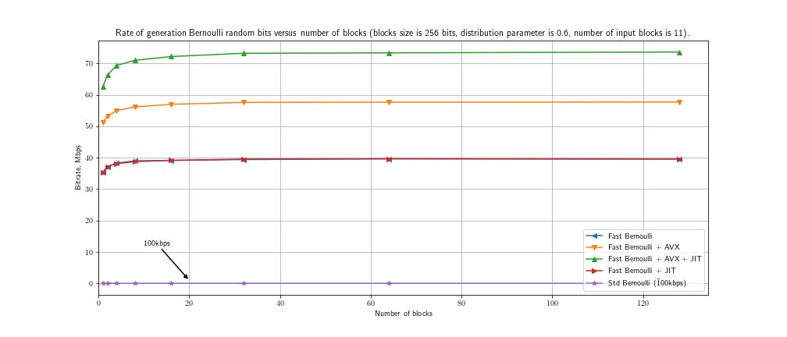

# Fast Bernoulli

*fast generation of long sequencies of bernoulli-distributed random variables*

## Overview

**Fast Bernoulli** &mdash; a library for sampling from Bernoulli distribution
with a specific parameters. Performant Bernoulli samplers are highly useful in
scientific and engineering fields: modeling, random graphs, coding theory, etc.

The standard way to obtain Bernoulli distributed random value is samping from
uniform distribution and thresholding with a parameter. The library expoits a
different property of Bernoulli random variables to attain better efficiency in
the sense of (P)RNG invocations.

Namely, logical operation (like not, or, and, xor) on two Bernoulli random
variables gives another random variable distributed according to Bernoulli law
with a new parameter. So, the concept behind is that Bernoulli distribution
with any parameter can be approximated with a sequence of other Bernoulli
random variables with different parameters and logical operators applied to the
sequence. Set of logical operators is not constrained in general but this
implementation is based on `and(&)` and `not(~)` operators. As soon as a target
distribtion paramer is "quantized" in a sequence logical operators, one can
apply the transformations to a sequence of random values in run-time to draw a
sample.

In order to archive better performance on practice, one need to improve sample
efficiency in sense of memory consumption. Standard implementation returns a
value of random variable as a bool-typed value which in fact consumes one byte.
In contrast, library returns block of random values. Each random value encoded
as a bit in a block. This fact allows to use vector extensions to instruction
set.

Another important assumption is that (P)RNG generates random number and bits in
generated numbers are distributed uniformly. In general, this is true
especially for top-quality (P)RNG (mt19937 as example). So, the assumption
allows to apply the described algorithm to bits of numbers obtained with
(P)RNG.

Another one improvement is rellated to implementation. Execution of a sequence
of logical operations on bits requires iterations in loop. Many iterations
affect performance through context switch and (un)conditional branching. The
best performance could be archived if distribution parameter or a set of
logical operators is known in compile-time. Just-in-time (JIT) compilation
facilitates overcoming the obstacle. The library supports LLVM which provides
JIT compiler infrastructure.

### Features

- [x] High efficiency per random bit.
- [x] Vectorization with AVX.
- [x] JIT compilation with LLVM.
- [x] Thread-safe.
- [x] Python bindings.

## Benchmarking

The only reason for creation of the project is efficient sampling. So, in this
section we present some benchmarks of sampler in different configurations. One
can see that the proposed implementation is ahead of standard Bernoulli sampler
(prefix `Std` in table or figure).

```
Run on (4 X 3400 MHz CPU s)
CPU Caches:
  L1 Data 32K (x2)
  L1 Instruction 32K (x2)
  L2 Unified 256K (x2)
  L3 Unified 4096K (x1)
--------------------------------------------------------------------------------
Benchmark                             Time          CPU  Iterations   Throughput
--------------------------------------------------------------------------------
BM_RandomNumberGeneration/128      4786 ns      4783 ns      147228  816.740 M/s
BM_StdSampler/128              72260140 ns  72208458 ns          10  55.3952 k/s
BM_GenericSampler/128            104076 ns    103545 ns        6745  37.7252 M/s
BM_AvxSampler/128                 71017 ns     70982 ns        9759  55.0314 M/s
BM_JitGenericSampler/128         103482 ns    103431 ns        6735  37.7669 M/s
BM_JitAvxSampler/128              55667 ns     55640 ns       12393  70.2053 M/s
```

Since one of the aims is to generate bulks of random values, it is interesting
to look at sampling efficiency in sense of bitrate with regards length of
generated sequence.



## Assembly

Build dependencies are (a) compiler with support C++17, (b) CMake as
build-system generator, (c) Make as default build system. Also building
requires (d) Google GTest for testing, and (e) Google Benchmark for
benchmarking. Optional dependency is (f) LLVM which provides JIT compiler
facility.
```bash
    mkdir -p build/release
    cmake ../.. -DCMAKE_BUILD_TYPE=Release -DBUILD_WHEEL=ON -DUSE_LLVM=ON
    make
```
LLVM is not required by default, so it could be turned on/off with option
`-DUSE_LLVM=ON/OFF` (as it is shown on the snippet above). Option `BUILD_WHEEL`
triggers building of Python bindings which could be find in directory
`fast-bernoulli/python/`. Target for building Python bindings is not included
to a set of default targets, so one should to run building of target
`fast-bernoulli-python-wheel` in advance.
```bash
    make fast-bernoulli-python-wheel
```

## Usage

The simplest way to construct sampler in C++ is just calling `CreateSampler()`
routine with target probability. The function returns a functor which should be
invoked with an instance of (P)RNG and aligned memory buffer. Finally, one
could bring samples to common representation (vector of bools).

```cpp
    #include <fast-bernoulli/fast-bernoulli.h>

    using namespace NFastBernoulli;

    // Assume 65536 bits with probability 0.6 should be generated.
    auto probability = 0.6;
    auto nobits = 65536;

    // Create an instance of ISampler and make buffer for sampling.
    auto sampler = CreateSampler(probability);
    auto ptr = sampler.MakeBuffer(nobits);

    // Use Mersenne Twister as a pseudo-random number generator.
    std::mt19937_64 rng;

    // Draw samples from Bernoulli distribution.
    sampler(rng, ptr);

    // Expand compressed representation of random values to vector of bools.
    auto values = Expand(ptr, nobits);
```

The function `CreateSampler()` is overrided in order to provide an advanced way
to instantiate sampler with structure `TSamplerOpts`.

Also, the library delivers Python bindings and an extremely simple usage
interface. Module `fast_bernoulli` provides function `sample()` which generates
random bits and returns memory view on resulting buffer of type `ui8`.

```python
    import numpy as np
    import fast_bernoulli as fb

    # Assume 65536 bits with probability 0.6 should be generated.
    probability = 0.6;
    nobits = 65536;

    # Draw samples from Bernoulli distribution. JIT is used.
    res = fb.sample(probability, nobits, seed=42, jit=True)  # memoryview
    arr = np.array(res)  # np.ndarray with dtype=np.uint8
```
